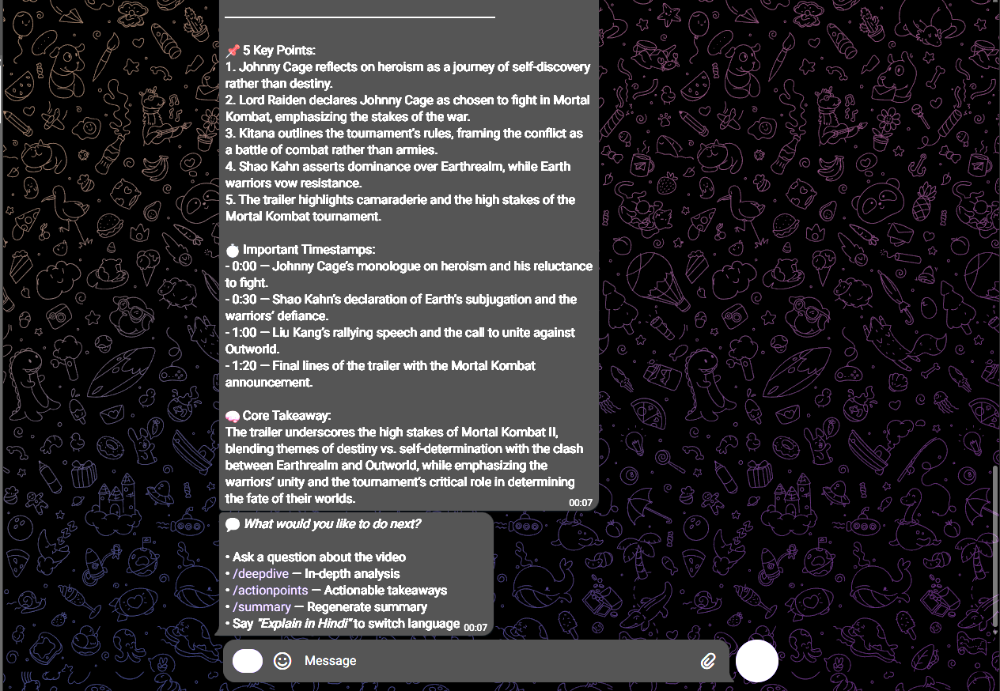
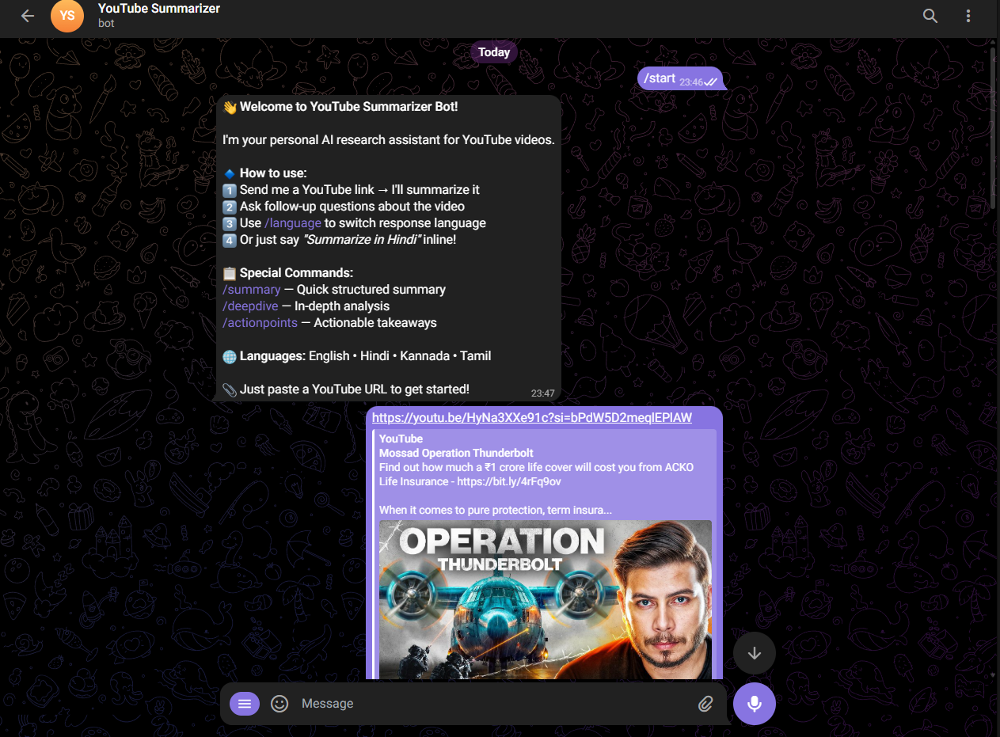
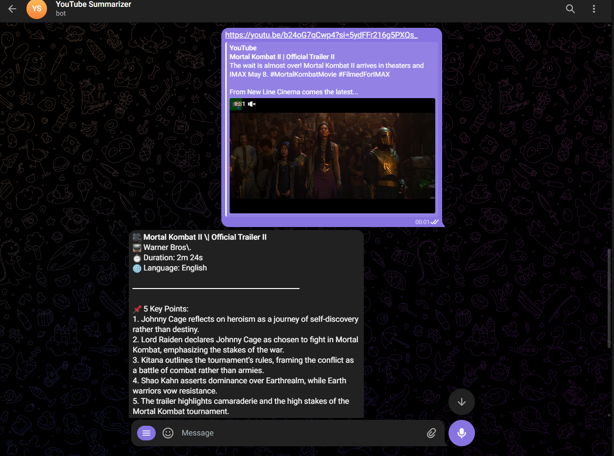

# 🎥 Telegram YouTube Summarizer & Q&A Bot

A smart Telegram bot that helps users understand YouTube videos quickly — summarizes content, answers follow-up questions, and supports multiple languages including Hindi, Kannada, and Tamil.

Built with **Ollama** (local LLM via OpenClaw), **python-telegram-bot**, and **youtube-transcript-api**.

---

## ✨ Features

| Feature | Description |
|---------|-------------|
| **YouTube Summarization** | Structured summaries with 5 key points, timestamps, and core takeaway |
| **Deep Dive Analysis** | In-depth content analysis with insights and audience targeting |
| **Action Points** | Actionable takeaways organized by timeline (immediate/short/long-term) |
| **Contextual Q&A** | Ask follow-up questions grounded in the video transcript |
| **Multi-language** | English, Hindi (हिन्दी), Kannada (ಕನ್ನಡ), Tamil (தமிழ்) |
| **Inline Language Switch** | Say "Explain in Hindi" — no need for commands |
| **Smart Caching** | Transcripts cached for instant re-use (FIFO, max 50 videos) |
| **Multi-user Support** | Independent sessions per user with isolated context |
| **Chat History** | Follow-up questions maintain conversational context |
| **Error Handling** | Graceful handling of invalid links, missing transcripts, Ollama outages |

---

## 🚀 Setup

### Prerequisites

- **Python 3.10+**
- **Ollama** installed and running ([ollama.com](https://ollama.com))
- A **Telegram Bot Token** from [@BotFather](https://t.me/BotFather)

### Installation

```bash
# 1. Clone the repository
git clone <repo-url>
cd "Telegram YouTube Summarizer & Q&A Bot"

# 2. Install Python dependencies
pip install -r requirements.txt

# 3. Pull an Ollama model
ollama pull qwen3:8b

# 4. Configure environment
cp .env.example .env
# Edit .env → add your Telegram bot token:
#   TELEGRAM_BOT_TOKEN=your_token_from_botfather
#   OLLAMA_MODEL=qwen3:8b

# 5. Start Ollama
ollama serve

# 6. Start the bot
python bot.py
```

---

## 📖 Usage

### Commands

| Command | Description |
|---------|-------------|
| `/start` | Welcome message with instructions |
| `/help` | Show all available commands |
| `/summary` | Regenerate structured summary for loaded video |
| `/deepdive` | In-depth analysis with insights |
| `/actionpoints` | Actionable takeaways & to-dos |
| `/language <lang>` | Set response language (english/hindi/kannada/tamil) |
| `/clear` | Clear current video session |
| `/status` | Check bot, Ollama, and cache status |

### Example Flow

```
User:  https://www.youtube.com/watch?v=abc123

Bot:   🎥 Video Title
       📺 Channel Name
       ⏱ Duration: 12m 30s
       🌐 Language: English
       ──────────────────────
       📌 5 Key Points:
       1. First key insight...
       2. Second key point...
       ...
       ⏱ Important Timestamps:
       - [02:15] — Topic introduction
       - [05:30] — Key demonstration
       ...
       🧠 Core Takeaway:
       The video explains...

User:  What did he say about pricing?
Bot:   💡 The speaker discussed pricing at [05:23]...

User:  /deepdive
Bot:   🔬 Deep Dive Analysis...

User:  Summarize in Hindi
Bot:   (Generates summary in Hindi)
```

---

## 📸 Screenshots

### Video Summary (Mortal Kombat II Trailer)

The bot generates structured summaries with video metadata, key points, timestamps, and core takeaway:







---

## 🏗 Architecture

### System Diagram

```
┌─────────────────┐     ┌──────────────────────────────┐     ┌─────────────────┐
│  Telegram User   │────▶│        bot.py                 │────▶│   Ollama LLM    │
│  (Multi-user)    │◀────│   ┌─────────────────────┐    │◀────│  (qwen3:8b)     │
└─────────────────┘     │   │  Session Manager    │    │     └─────────────────┘
                        │   │  (per chat_id)      │    │
                        │   └─────────────────────┘    │
                        │   ┌─────────────────────┐    │
                        │   │  Transcript Cache   │    │
                        │   │  (FIFO, max 50)     │    │
                        │   └─────────────────────┘    │
                        └──────────┬──────┬────────────┘
                                   │      │
                          ┌────────┘      └────────┐
                          ▼                        ▼
                  ┌──────────────┐       ┌──────────────┐
                  │ transcript.py│       │ video_info.py│
                  │ (YT API)     │       │ (yt-dlp)     │
                  └──────────────┘       └──────────────┘
```

### Design Trade-offs

#### 1. In-Memory Sessions vs Database
**Choice:** In-memory dictionary keyed by `chat_id`

| Pros | Cons |
|------|------|
| Zero setup, no external dependency | Lost on bot restart |
| Microsecond access time | Memory grows with users |
| Simple, easy to reason about | Not suitable for massive scale |

**Rationale:** For a demonstration bot, simplicity wins. A production version would use Redis or SQLite.

#### 2. Full Transcript Injection vs RAG/Embeddings
**Choice:** Inject full (truncated) transcript into every LLM call

| Pros | Cons |
|------|------|
| 100% recall — no retrieval misses | Limited by model context window |
| No vector DB dependency | Larger prompts = more tokens |
| Simpler, more reliable | Doesn't scale to very long videos |

**Rationale:** YouTube transcripts typically fit within 8K-16K token context windows. RAG adds complexity without significant benefit for this use case.

#### 3. Prompt Engineering vs Translation API
**Choice:** Multilingual via prompt instructions, no translation layer

| Pros | Cons |
|------|------|
| No external API cost or dependency | Quality depends on model's language ability |
| More natural-sounding output | May mix languages for weak models |
| Single model handles everything | Limited to languages model knows |

**Rationale:** Modern models (qwen3, llama3) handle Hindi, Kannada, and Tamil well. This avoids the latency and cost of a separate translation step.

#### 4. Smart Caching (FIFO Eviction)
**Choice:** Cache transcripts by video_id with max 50 entries

| Pros | Cons |
|------|------|
| Instant re-use for popular videos | Memory grows (bounded at 50) |
| Reduces YouTube API calls | Stale data possible (unlikely for transcripts) |
| Cross-user benefit | Simple FIFO, not LRU |

**Rationale:** Transcripts don't change, so caching is safe. FIFO is simple and sufficient for the expected load.

#### 5. Anti-Hallucination Strategy
**Choice:** Strict grounding prompts + explicit "not found" response

Every LLM call includes:
- System prompt: "ONLY answer based on the transcript"
- User prompt: "If not found, say: ⚠️ This topic is not covered"
- Temperature: 0.3 (low creativity)

---

## 📁 Project Structure

```
.
├── bot.py                  # Main entry point — Telegram handlers & routing
├── requirements.txt        # Python dependencies
├── .env                    # Environment config (bot token, model)
├── .env.example            # Template for .env
├── .gitignore
├── README.md               # This file
└── src/
    ├── __init__.py
    ├── config.py            # Environment loading & language constants
    ├── transcript.py        # URL parsing, transcript fetching, chunking, stats
    ├── video_info.py        # Video metadata (title, channel, duration) via yt-dlp
    └── summarizer.py        # Ollama LLM: summary, deepdive, action points, Q&A
```

---

## ⚠️ Edge Cases Handled

| Scenario | Bot Response |
|----------|-------------|
| Invalid YouTube URL | Prompts for valid URL format |
| Partial/malformed URL | Detects YouTube pattern but reports invalid ID |
| No transcript available | Clear error with possible reasons |
| Private/age-restricted video | Specific error message |
| Non-English transcript | Works — transcript API auto-selects available language |
| Very long video (>15K chars) | Truncates with notification, summarizes key parts |
| Rate limiting | Friendly "try again" message |
| Ollama not running | Specific error with fix instructions |
| Question without video loaded | Prompts to send link first |
| Multiple users simultaneously | Isolated sessions per chat_id |
| Repeated video link | Served from cache instantly |

---

## 🌐 Supported Languages

| Language | Command | Inline Trigger |
|----------|---------|---------------|
| English | `/language english` | Default |
| Hindi | `/language hindi` | "Explain in Hindi" |
| Kannada | `/language kannada` | "Summarize in Kannada" |
| Tamil | `/language tamil` | "Answer in Tamil" |

---

## 🔧 Configuration

| Variable | Default | Description |
|----------|---------|-------------|
| `TELEGRAM_BOT_TOKEN` | — | **Required.** From @BotFather |
| `OLLAMA_MODEL` | `qwen3:8b` | Ollama model name |
| `OLLAMA_BASE_URL` | `http://localhost:11434` | Ollama API endpoint |

---

## 📋 Tech Stack

| Technology | Purpose |
|------------|---------|
| Python 3.10+ | Core language |
| python-telegram-bot | Telegram Bot API framework |
| youtube-transcript-api | Fetch YouTube transcripts (no API key needed) |
| yt-dlp | Video metadata extraction (no download) |
| Ollama | Local LLM inference (OpenClaw-compatible) |
| python-dotenv | Environment variable management |
